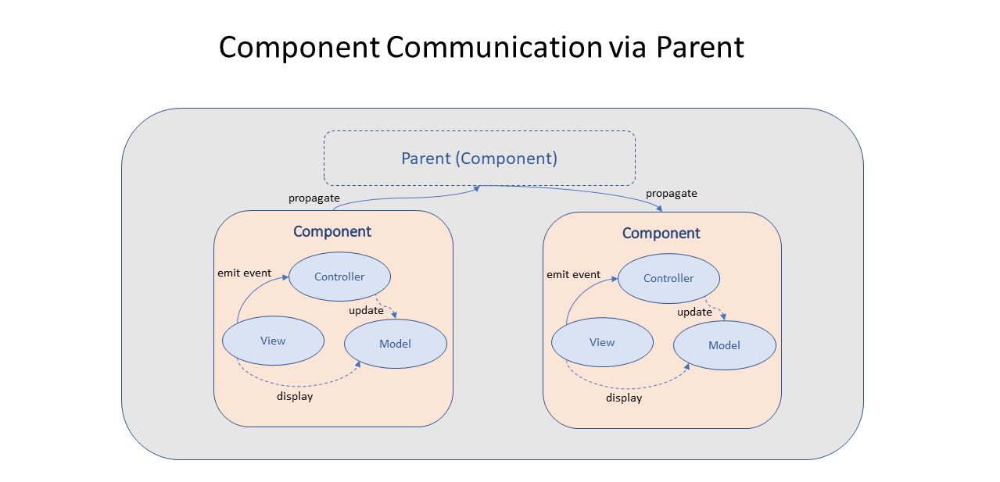
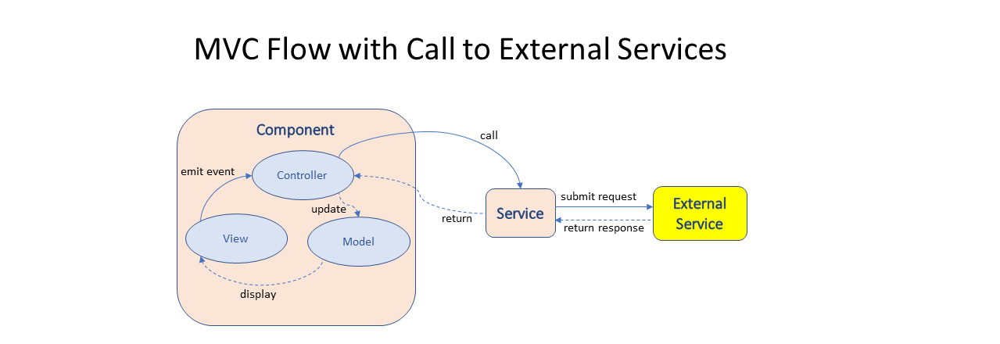
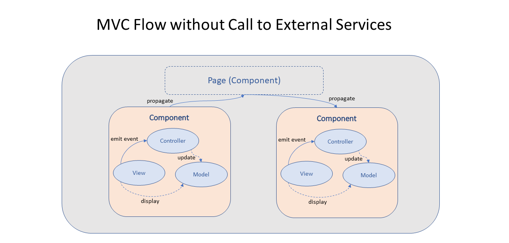

# # Mobile Web Banking PoC with Angular

This project illustrates the impelmentation of Component pattern, MVC pattern and Template Method pattern in an Angular-based web
application.

MVC (Model View Controler) pattern is the first Graphical User Interface design pattern. There are many variations of MVC pattern,
for example, MVP (Model View Presenter) pattern and MVVM (Model View View-Model) pattern.

Model can refer to different things by different programmers. In web applications, we have request data model, response data model and
view-model. The view model, which refers to the data that the View displays, is undoubtedly the most important one. In this document,
the model is used interchangeably with view-model .

A common misconception about MVC (and its variations) is that it divides the whole application into three parts: Model, View and 
Controller. This is true only for small applications. For middle to large applications, we need to split the application into many 
small parts, a.k.a, components, and each component serves as a facade that wraps the Model-View-Controller triad. Components 
communicate with each other directly or via a mutual parent component, as illustrated below.

Just like in the traditioal OO programming languages (Objective-C, C++, Java, C#, Swict, etc.), there are scenarios where certian JavaScript
classes have some common functionalities with a little variation. The Template Method pattern is the powerful tool that handles these scenarios
elegantly, resulting in cleaner code and avoiding duplicate code. The Template Method design pattern is used intensively in this project.

## Coparison with Redux Pattern
The design patterns used in this application reflects my vision of how a web application should be structured.
Please compare this project with my other project [mobileweb-angular-redux-poc](https://github.com/dhui808/mobileweb-angular-redux-poc), 
which follows the Redux pattern. The Redux pattern results in too much boilerplate code is essentially an anti-pattern.

## Architecture

## Build
Run `ng build` to build the project. The build artifacts will be stored in the `dist/` directory.

## Start backend mockup server
see [webservice-mock-server](https://github.com/dhui808/webservice-mock-server)

## Start Development UI server
Run `ng serve` for a dev server.

## Technology Version
Angular 9.0.7\
Typescript 3.7.5\
